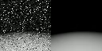
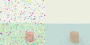
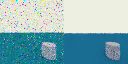
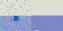
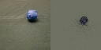
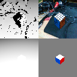

# modppl-derender

Inverse graphics in [ModPPL](https://crates.io/crates/modppl): combine a rendering-based
generative scene model with user-space MCMC inference to recover structured 3D scene
hypotheses directly from images. Each scene is a probabilistic program (a prior over camera
pose, object pose/size/color, and lighting) paired with a ray-traced renderer used as the
observation likelihood. Inference is plain Metropolis-Hastings over the program's own random
choices, with custom proposals where the default ones aren't enough.

## Gallery

Each pair below is observation (left) vs. the inferred hypothesis converging onto it (right),
20fps. Click a thumbnail for the full video.

### Synthetic

| | | |
|---|---|---|
| [](out/ground.mp4)<br>**Depth-only ground plane** — camera pose from a depth observation alone | [](out/sphere1.mp4)<br>**Sphere + color** — position, ground albedo, ambient light, and sphere hue | [](out/mug.mp4)<br>**Mug** — a cylinder with unknown pose and color, more latent dimensions than the ball |
| [](out/rubiks.mp4)<br>**Rubik's cube** — a cube with fixed, deterministic per-face colors (`Cube::color_at`), only pose/size inferred | | |

### Real hardware

| | |
|---|---|
| [](out/ball.mp4)<br>**Ball, from a real photo** — derendering an actual `.bmp` photograph, not a synthetic render | [](out/thumbs/live_rgbd.png)<br>**Live RealSense demo** — real depth+color camera input (top) vs. the live-inferred cube hypothesis (bottom), via `live_rgbd_cube` |

## Models

- `grounded_depth_model` — depth-only camera pose recovery against a ground plane.
- `sphere_color_model` — sphere position + color under unknown lighting.
- `ball_model` — a ball on a table; the `test_derender_ball` test derenders an actual
  photograph (`tests/ball.bmp`), not a synthetic observation.
- `mug_model` — a cylinder (mug) with unknown pose, size, and color.
- `rubiks_model` — a cube with deterministic Rubik's-cube face coloring; only pose/size
  are latent.
- `cube_depth_model` / `cube_rgbd_model` — depth-only and depth+flat-color variants used by
  the live RealSense demo (see below).

All live in [`src/core/models.rs`](src/core/models.rs), written with the `dyngen!` macro.
Inference sweeps are built with the `Kernel` combinator
([`src/inference.rs`](src/inference.rs)):

```rust
let renders: Vec<Colors> = Kernel::new(&ball_model, trace)
    .regen_mh(&cam_mask)
    .regen_mh(&env_mask)
    .mh(&gaussian_drift, (vec!["table_c0", "table_c1", "table_c2"], 0.1))
    .regen_mh(&ball_mask)
    .mh(&gaussian_drift, (vec!["ball_u", "ball_v", "ball_radius"], 0.1))
    .regen_mh(&ball_color_mask)
    .take(NUM_ITERS)
    .map(|t| t.retv.clone().unwrap())
    .collect();
```

## Running the tests

```sh
cargo test --release --test derender
```

Renders MP4s to `out/`. Resolution and clipping planes are runtime-configurable (default
64×64, tuned for the synthetic models):

```sh
RES=128 cargo test --release --test derender test_derender_mug
```

## Live RealSense demo

`src/bin/live_rgbd_cube.rs` derenders a real Intel RealSense D435 depth+color stream against
`cube_rgbd_model` in real time — tracking a physical cube's pose via depth (no
lighting/material sim-to-real gap) and its face orientation via a flat, no-lighting color
render (viable because real stickers are already flat and saturated). Requires
`librealsense2` and a connected D400-series camera.

```sh
NEAR_M=0.15 FAR_M=1.0 cargo run --release --bin live_rgbd_cube
```

- `RES` — render resolution (default 64).
- `NEAR_M` / `FAR_M` — depth clipping planes in meters; tune to your actual working distance
  (defaults suit the synthetic models' world scale, not a close-up real scene).
- `FOVY_RAD` — vertical FOV in radians; normally set automatically from the camera's real
  intrinsics at startup, not guessed.

Opens a window with observed depth/color (top) and the live inferred hypothesis (bottom).